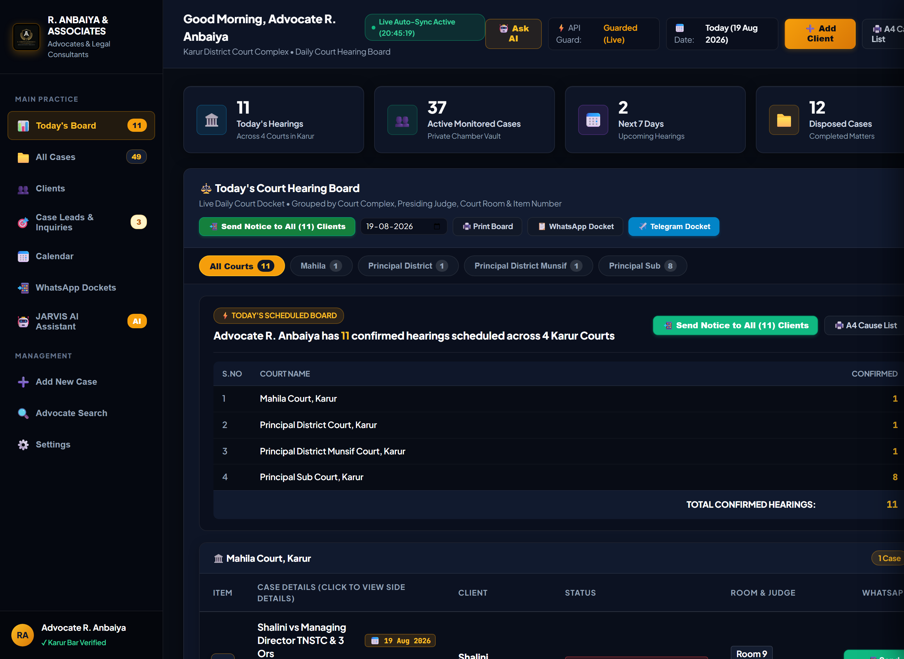

# ⚖️ eCourts Autonomous Legal Case Tracker & WhatsApp Dispatcher

An intelligent, autonomous system built for advocates and legal practices to track Indian court cases (Supreme Court, High Courts, District Courts), monitor upcoming hearing schedules, and automatically dispatch hearing updates to clients via WhatsApp.

---



---

## 🌟 Key Features

- **🔍 Dual Engine Architecture:**
  - **API-First Engine:** Ultra-fast, direct integration with the official eCourts Partner API (`https://webapi.ecourtsindia.com`).
  - **Autonomous Self-Correcting Agent (LangGraph):** Playwright + Vision OCR loop engineering that solves portal CAPTCHAs and auto-retries on failure.
- **📊 Real-Time Case Details Extraction:**
  - Case Title & CNR Number parsing.
  - Court Name, State, and District.
  - Case Status (Pending, Disposed, Appearance).
  - Next Hearing Date & Decision Date.
  - Hearing count & Certified Order count.
- **💬 Automated WhatsApp Notifications:**
  - Formats clean, professional WhatsApp hearing update alerts with client names and case summaries.
  - One-click dispatch via WhatsApp Web and WhatsApp Mobile deep links.
- **💾 Local SQLite Database:**
  - Automatically indexes tracked cases in `cases.db`.
  - Detects changes in next hearing dates and flags notification triggers.
- **🌐 Interactive Web Dashboard:**
  - Modern web UI to manage, query, and monitor cases in real time.

---

## 🏗️ Architecture

```
                       [ ⚖️ Client / Advocate Web UI ]
                                      │
                 ┌────────────────────┴────────────────────┐
                 ▼                                         ▼
      [ 🚀 eCourts Partner API ]              [ 🤖 LangGraph Vision Agent ]
       (High-speed JSON endpoint)             (Playwright + EasyOCR Loop)
                 │                                         │
                 └────────────────────┬────────────────────┘
                                      │
                                      ▼
                           [ 💾 SQLite Database ]
                         (Hearing Date Change Detection)
                                      │
                                      ▼
                      [ 📲 WhatsApp Alert Dispatcher ]
```

---

## 🚀 Getting Started

### 1. Clone the Repository
```bash
git clone https://github.com/Mukil630/ecourts-case-tracker.git
cd ecourts-case-tracker
```

### 2. Install Dependencies
```bash
pip install -r requirements.txt
```

### 3. Configure API Key
Create a `.env` file in the root directory:
```env
ECOURTS_API_KEY=eci_live_your_api_key_here
```
*(Get ₹200 free API trial credits at [webapi.ecourtsindia.com](https://webapi.ecourtsindia.com))*

---

## 🌐 Live Cloud Deployment (24/7 Always Online)

The platform is deployed live on Render with automatic 24/7 background sync:
* **Live App URL:** [https://ecourts-case-tracker.onrender.com](https://ecourts-case-tracker.onrender.com)
* **Health Check & Keep-Alive:** [https://ecourts-case-tracker.onrender.com/healthz](https://ecourts-case-tracker.onrender.com/healthz)

---

## 🖥️ Running Locally

### 🌐 Option A: Start the Interactive Web Dashboard
```bash
python server.py
```
Open your browser at: `http://127.0.0.1:5000`

### 💻 Option B: Run CLI Case Tracker
```bash
python case_tracker.py DLND020047882015
```

### 🤖 Option C: Run Autonomous LangGraph Agent Loop
```bash
python ecourts_agent_graph.py DLND020047882015
```

---

## 📂 Project Structure

```
ecourts_automation/
├── .env.example            # Environment template
├── .gitignore              # Git ignore rules (protects private keys)
├── requirements.txt        # Python package dependencies
├── README.md               # Project documentation
├── server.py               # Web dashboard backend (Flask)
├── db.py                   # SQLite database manager & date change tracker
├── ecourts_api.py          # Official eCourts Partner API client
├── case_tracker.py         # CLI Case Tracker & WhatsApp generator
├── ecourts_agent_graph.py  # LangGraph Autonomous Agent with OCR loop
└── static/                 # Web Dashboard Frontend
    ├── index.html
    ├── style.css
    └── app.js
```

---

## 📜 License
MIT License. Created by Mukil.
